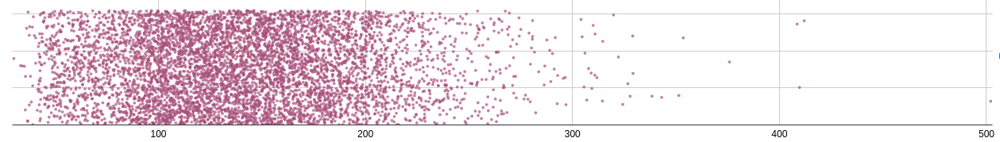
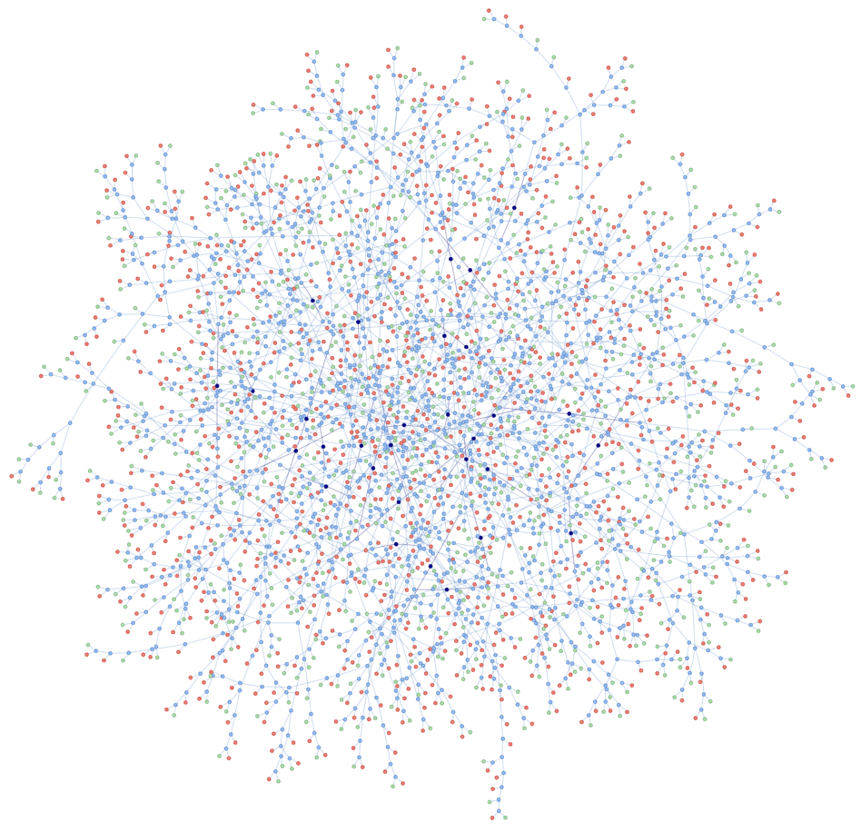

# Compacting Decision Trees

Recently, I was making a classifier for acute kidney injury (AKI). I
have a dataset of around 14,000 entries, each representing a patient. I
have their age, sex and between 0 and 45 timestamped creatinine samples.

## Background

If you don't know, a 'decision tree' is a learned function that takes
the form of a flow chart. The questions on the flow chart ask me
something about the patient "is the patient older than 65?". If yes, I
might go down one path, if no, I'll go down another. It's my job to
construct a sufficiently complex tree with lots of good questions so
that if you walked through this tree, you could decide whether somebody
has AKI with pretty good confidence.

First, we need to aggregate everyone's creatinine test results, because
it's hard to compare Bob with 41 test results with Dylan who only has 2.
You can choose things like the *median* of Bob's creatinine results, or 
the *range*. Something like that. Then we just have one value for Bob 
and one for Dylan. Our patient data might look something like this now:

```c
struct patient_data {
    bool sex;
    uint8_t age;
    float mean_cr; 
    float recent_cr;
    float stdv_cr; 
};
```

Next, we need to construct our tree. The classic way of doing this is to
cycle through a bunch of questions about the data that split it in half.
We give each split a score (e.g. [information gain](
https://en.wikipedia.org/wiki/Information_gain_ratio)) and make the
first question in our tree the one that maximized that score. Then we 
ask questions about each half of the split data in the same way until 
we reach some terminating condition.

The trickiest part of this is "what questions do I ask?". If the patient
data is already a list of **binary features** (e.g. "male/female" for
sex), it's easy just say "is this patient male?". The hard part comes
when you need to ask questions about real numbers, like creatinine test
results.

## Deciding Features

What if I told you that I can get good performance by turning my real
numbers into around **four** binary features? This _vastly_ simplifies
decision tree construction, _hugely_ compacts the data and is generally
just cool. For example our patient data can be packed into around 16 
bits (down from 112) and there are only 16 questions to try out (instead
of hundreds or even thousands with traditional methods). 

If we take the data for a given feature (`mean_cr` for example) we get
some distribution like this:



Think of this kind of like a histogram. We're trying to see how many 
people have a mean creatinine value (look, I don't know what this is 
measured in -- the dataset doesn't say) of X. 

I take all this data and divide it into **N** buckets. The **nᵗʰ**
bucket is assigned a value such that **(n/N)%** of people have a
`mean_cr` less than that value and the rest have a `mean_cr` greater
than that value (basically). If you had 100 buckets, the iᵗʰ bucket
would represent the mean of the values in the i..i+1ᵗʰ percentiles.
Conceptually you can think of this as squishing the sparse bits of the
data and stretching the dense bits of the data.

If I split this into 32 buckets, I now have a function that takes a 
`mean_cr` and spits out which percentile (really 'per-32-ile') it fits
into. I dont want you to think of this as percentiles though. I want you
to think of it as squashing the data into as few integral values as 
possible, while keeping _as much information as possible_. It's a form
of _compression_, **_that's_** the intuition!

Now, we take this function (which, btw is a binary search) and use it to
convert each `mean_cr` into a value from 0 to 31. Then, we encode this 
5-bit number as 5 binary features. That's it... and it _works_!

## Why Does it Work?

Here's a graph when I first started adding features to this model. I
think at this point I just use `{ sex, age, recent_cr, median_cr }`. I
train on 7000 datapoints and test on another 7000 datapoints and compute
an F₃-score. 


As you can see, 3-5 bits is optimal for this. From tweaking the model,
as training data increases using 6-7 bits becomes a better choice. 

I peaked at a 0.985 F₃-score, before screwing up some weights right
before the deadline for this coursework (you receive full marks for a
0.95 F₃-score). This puts me around the middle of the class average.
Considering though that I don't implement pruning, or take into account
the dates of the creatinine scores and only use 40 bits of features, the
fact that I am doing better than random forest models that train for 20x
longer with some Python framework is genuinely not that bad (I think).
Anyway, it's more cool that this works _at all_.

I think the intuition here is that a 4-bit number representing the 
per-16-ile is acutally a really nice way of representing decisions to 
narrow down a region of a distribution. The first bit says "I am in the
top or bottom 50%" The second says "I am in the top or bottom 50% of 
_this_ subdistribution". Etc. Fun. 

## Speed

What we should really be comparing this to is the performance of the
[NHS algorithm](https://www.england.nhs.uk/akiprogramme/aki-algorithm/).
I don't know the exact performance (I need to test it). But roughly, for
every 1000 people who come have AKI, we send ~200 of them home saying
they don't have it. With this simple classifier that number gets reduce
to ~20.

What's _even worse_ is that the **most complicated version of** the
algorithm I've made could be run in reasonable time in the 1990s on a
_PC CPU_ when we
[_knew about decision trees_](https://www.taylorfrancis.com/books/mono/10.1201/9781315139470/classification-regression-trees-leo-breiman-jerome-friedman-olshen-charles-stone) already.

Currently inference (read string data in, parse, produce classification,
on my laptop [single core, ]) takes ~1.5μs. Even if we assume that the
Pentium 60 was 1000x slower (which is probably wasn't), that's still in
the order of milliseconds!

Training takes 10ms-150ms depending on the size of the random forest and
the amount of input data. On a Pentium 60, That's 10s to 3 minutes. This
is _totally reasonable numbers_!!! This code isn't even particularly
aggressively optimized. Basically, we've had the ability and knowledge
to diagnose this illness with excellent accuracy for over 30 years and
we're still not doing it. What the heck.

Here's a fancy representation of my random forest though.


