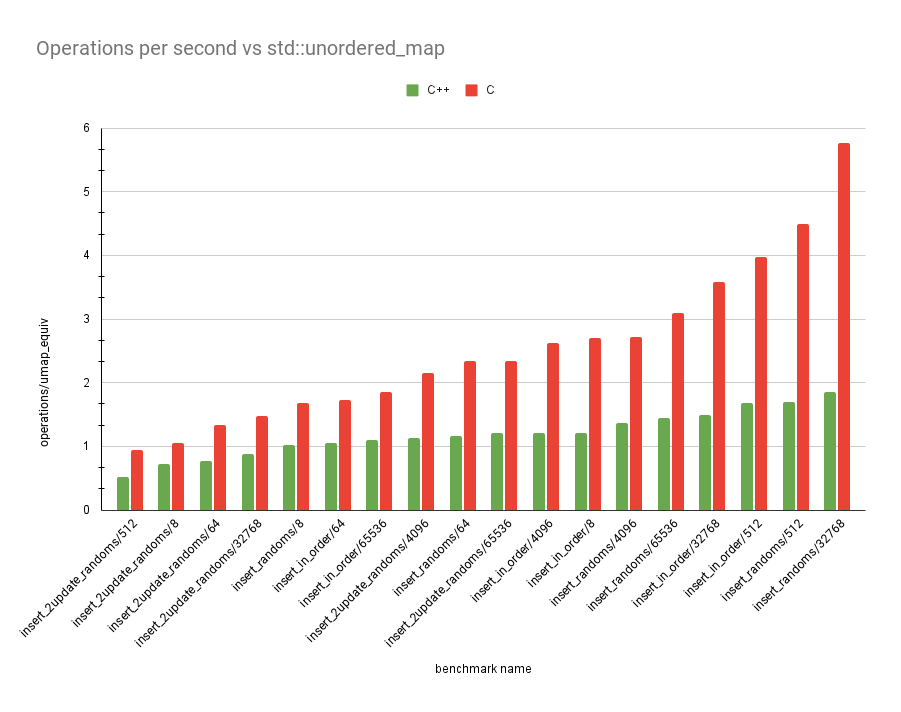
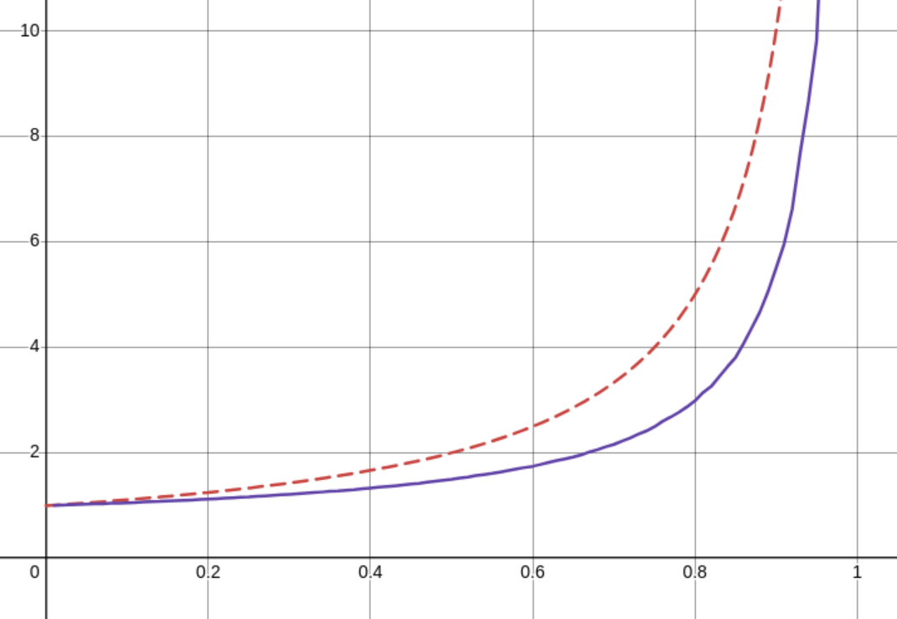

# Hashtable Math 

As is evident from the [previous article](/blog/hashtbl.html), I am
currently building a hash table. I made my hash table rather fancy and 
used lots of SIMD instructions. The thing is, this hashtable ended up
not being very fast at all. In fact, I made an incredible simple C 
implementation and it outperformed my facy C++ version in all tests.

The whole thing is about 100 lines, including whitespace and is very 
simple. Below is the lookup code, which encapsulates pretty much all the
hashtable-specific logic. The full source can be found The full code can
be found [here](https://github.com/D0liphin/HashTable/blob/master/include/table.h).

```c
struct entry *table_get_slot(table *tbl, key_t k)
{
        size_t h = hash(&k, sizeof(key_t));
        for (size_t i = h % tbl->capacity; true; i = (i + 1) % tbl->capacity) {
                tbl->nr_probes++;
                struct entry *e = &tbl->buf[i];
                if (e->meta == CTRL_EMPTY) {
                        return e;
                } else if (e->meta == CTRL_DEL) {
                        continue;
                } else if (e->key == k) {
                        return e;
                }
        }
}
```



The graph above is in operations performed for every equivalent 
`std::unordered_map` operation. The tests are the same as last time.
Again, `insert_2update_randoms` performs the worst, but yo ucan see how
much better the C version is overall!

This got me thinking about why this version might be so much faster. I
think it's because my version does the following:

1. Find the associated control chunk
2. Do a bunch of vector instructions to generate a bitmask
3. Consume the bitmask with `tzcnt` (3 cycles at a time)

The simple C version does the following:

1. Find the associated element
2. Iterate over the elements in a predictable way with pointer offsets
   (1 cycle).

There are all sorts of benefits for the latter. For example, we don't
fill up the instruction buffer so OOO hardware can prefetch more clevery
if it ever needs to. But I think more importantly than something like
that, we just do _less compute_ than the original version since we
hardly ever probe anyway. If we do less than 3 probes 99% of the time,
we may as well use a `uint8x4` instead of a `uint8x16`!

## Working out the average number of hashtable collisions

I've always wanted to do this math. So I finally sat down and worked it
all out. It could be all wrong, but I looked it up and I got the right
answer. Email me if it's wrong! Disclaimer, I wrote this really late at
night and I'm pretty sure I made a mistake about halfway through and 
just got lucky. You can skip to the last section if you just want the 
results of it all.

There are two questions to ask here:

1. What is the average number of collisions when our hashtable is `l` 
   full?
2. What is the average number of collisions for a hashtable with load
   factor `L`?

I'll try and use `l` and "load" for the proportion of our hashmap that 
is _currently full right now_ and `L` and "load factor" for the maximum
allowed `l` before we trigger a realloc. I'm using code snippets 
because I generate these blogs from markdown. I'm using images for the 
math. 

So, we're looking for an empty cell to put our entry. Let's say we've 
probed `i` entries already. What is the chance that the next entry is 
empty?

$$P(\text{empty} | i \text{ were occupied}) = \frac{(1 - di) - (l - di)}{1 - di}$$

I'm skipping a few steps here, but hopefully it's still intuitable.
Normally, the chance of finding an element would be $(1 - l) / 1$.
Remember, the hashtable is $l$ full, so we just take the empty part,
which is $1 - l$ and divide it by the total size of the hashtable, which
is just $1$. If we know that $i$ are occupied, we remove $i$ from the
total capacity _and_ $l$. An example would be like if we had 10 elements
in the table and 4 were full. If we've checked 2 and they're both full
we know the next one has a chance of $(4 - 2) / (10 - 2)$ of being
empty. Since we're taking the capacity to be $1$ though, we just say
that there is some constant $d$ that represents some portion of the
capacity we've removed. For our example, we could say $d$ is $0.1$ and
get the same values.

```
(1 - 0.1 * 2) / (1 - 0.1 * 2) == (4 - 2) / (10 - 2)
```

In similar logic which I will not explain much in depth, the chance of 
getting `i` consecutively occupied cells is just the product of the 
chance of getting all previous cells occupied. The calculation is just 
the opposite of what we had above.

$$P(i \text{ consecutively occupied}) = \prod_{j=1}^{i} \frac{l - dj}{1 - dj}$$

So the chance that we will find the empty cell after _exactly_ $i$ 
probes is these two probabilities multiplied together.

$$\lim_{d \rightarrow 0 }\frac{1 - l}{1 - di} \prod_{j=1}^{i - 1} \frac{l - dj}{1 - dj} = l^{i - 1}(1 - l)$$

I've taken an extra step with the above and rearranged the first 
equation. Now, as the hashmap size tends towards infinity, the step 
factor $d$ becomes closer and closer to 0. When $d$ is 0, the equation
is just equivalent to that small little thing on the right! 

That's pretty useless though, because we want to find the chance of 
getting a result in $i$ probes _or fewer_. So we want to know the chance 
of getting it in $1$ probe or $2$ probes or $3$ or $4$ or $5$ probes
etc. etc. all the way to $i$. First, the chance of geting our slot in
less than $i$ steps is the sum of all the chances of getting a miss 
before $i$.

$$\sum_{j=1}^i l^{j - 1}$$

And if we rewrite this with $i - 1$ at the top, we can take it as a 
geometric series and find a closed form of the whole thing, including 
the chance of a hit bit.

$$(1 - l)\sum_{j=0}^{i - 1} l^j = (1 - l)\frac{1 - l^i}{1-l} = 1 - l^i$$

This tells us the chance of finding an empty slot after doing $i$ 
probes. The graph of that looks like this for $l = 0.75$


The chance of reaching the $i$th probe is just $L^(i - 1)$. There's no
math for that, it's just the opposite of that. Starts at 0.75 and goes 
down to 0, instead of the other way round.

So what's the average **cost** of an insertion? Well, that's the chance
of getting to probe $i$ multiplied by the cost of probing $i$ times...
which is just $i$. I notice now while writing this article that I've 
done a little more work than I need. I'm not really sure how this one 
worked out actually, since the intuition isn't quite right here... 

Regardless, the probe cost calculation looks like this.

$$\sum_{i=1}^{x}iL^{i-1} = 1L^0 + 2L^1 + 3L^2 + \ldots (x + 1) L^{x}$$

If you're clever, you'll notice that this is a geometric sequence that 
has been differentiated! So we can find $\frac{d}{dL}$ for some geometric 
series, and this is going to be our summation closed form!

$$\frac{d}{dL}L^0 + L^1 + L^2 + L^3 + \ldots + L^{x + 1}$$
$$= \cancel{0L^{-1}} + 1L^0 + 2L^1 + 3L^2 + \ldots (x + 1)L^x$$
$$\sum_{i = 1}^x iL ^i = \frac{d}{dL} \frac{1 - L^{x + 1}}{1 - L}$$
$$\frac{d}{dL}\frac{1 - L^{x + 1}}{1 - L} = \frac{xL^x - xL^{x + 1} + L^x - 1}{(1 - L)^2}$$


This is for reaching only up to the $x$th probe though. For us, we want 
to consider the entire space all the way up to infinity. Taking the 
limit of $x$ to infinity gives us 

$$\lim_{x \rightarrow \infty} - \frac{xL^x - xL^{x + 1} + L^x - 1}{(1 - L)^2} = \frac{1}{(1 - L)^2}$$

Tada! ✨ That's the cost of an insertion at `L` load. (I know I said `l`
would be the load, oops). I have to remember to go back and clean up 
that mistake earlier. I can't remember exactly my thinking now, but to
me, you don't need to do that previous summation, just the one above.
Anyway.

Finally, as I said before, we are considering the average cost for all
insertions to our map in the range `0..L`. So we should take the average
insertion cost over the allocations lifetime. This is just the integral
over `L`.

$$\frac{\int_0^L \frac{1}{(1 - x)^2}} dx{L} = \frac{1}{1 - L}$$

## It doesn't work though! 😔

So that's all well and good. And I looked it up and [this stack 
overflow post](https://stackoverflow.com/questions/61494530/relation-between-the-load-factor-and-time-complexity-in-hash-tables)
tells me I'm right. I was really happy about this (even though it looks
like my math will need an errata soon). The thing is, that's not how 
my actual hash table behaves... Like _at all_.

You can find the source code of a hashtable in the folder that you're 
in right now. It's at [`table.c`](table.c) and [`table.h`](table.h).
This hashtable is _thoroughly tested_ against hundreds of millions of 
random operations on an oracle map. It works. It comes with an option
to set the load factor and keeps track of the number of probes it's 
done in its lifetime.

I wrote some code that finds out both the probe cost at a given load `l`
_and_ some code that finds out the probe cost across the hashmap
allocation's lifetime for a given load-_factor_ `L`. You can find the
full source [here](graphs.c). It's pretty simple though, for the first
case, we just get a number _really_ close to the max capacity and fill
a map all the way till its full.

```c
for (double l = 0.01; l < 1; l += 0.01) {
        table tbl;
        table_init(&tbl, CAPACITY, l);

        int nr_insert = (int)((double)CAPACITY * l);
        for (int n = 0; n < nr_insert; ++n) {
                table_insert(&tbl, rand(), 0);
        }
        printf("(%f,%f),", l, (double)tbl.nr_probes / (double)nr_insert);

        table_free(&tbl);
}
```

This graph looks like this



The red, dashed line shows what I calculated the average number of 
probes to theoretically be and the purple shows what it actually is.
I'm actually not so bothered about what I can do with this data, I'm
more bothered that I screwed up the math.

Next, we have the average cost at a specific load. This one I ran this 
test at an excessive number of iterations (hoping for a smoother graph)
but it always remained very jittery

```c
table tbl;
table_init(&tbl, CAPACITY, 0.99999999);

int nr_insert = CAPACITY - 1;
for (int n = 0; n < nr_insert; ++n) {
        size_t l = (size_t)(table_load(&tbl) * STEPS + 0.5);
        size_t old_nr_probes = tbl.nr_probes;
        table_insert(&tbl, rand(), 0);
        size_t nr_probes = tbl.nr_probes - old_nr_probes;
        probes_at[l] =
                (probes_at[l] * (double)n + (double)nr_probes) / ((double)n + 1);
}

table_free(&tbl);
```

This test fills a map of 1000 elements millions of times over and
updates a big map of `(l, cost)` pairs. This one should behave like
`1 / (1 - x)^2`.


As you can see, also not quite right. But what's strange here too is 
that even though this is the average over something like 100 million 
updates, the line is still very jittery. I really have no idea what's 
causing this, because it's not _reproducable_ jitter.

## So what's next?

Well, a few things. There are lots of questions yet to be answered

1. Why do the theoretical results not match up... _at all_?
2. Does the probing method affect the practically obtained results?
3. Why is the graph of load vs probe count so jittery?
4. How can we use all this data to make a faster hashtable?

I hope to answer all these questions soon! I suspect this series is not
going to finish any time soon.