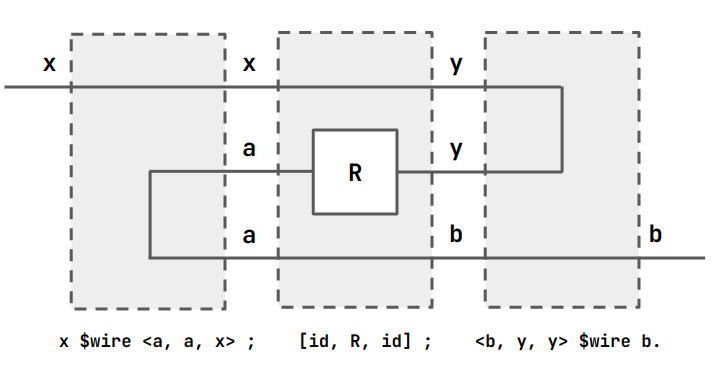

# Oli's Little Guide to Ruby

This is about the 1986 HDL Ruby, made by [Mary Sheeran](https://www.cse.chalmers.se/~ms/).

## Basic Relations

- Ruby defines blocks with a domain and range.
- Domain variables are read bottom-to-top, left-to-right and are on the
  left or top of the block.
- Range variables are read left-to-right, bottom-to-top and are on the
  bottom or right of the block.
- Blocks might perform computation.


In ruby we can describe this as follows:

```
f = VAR a . a $rel a.
```

If `f` performs a function `g` on its input, we can write:

```
f = VAR a . a $rel (`g` a).
```

`f` can be used as a function. For example, it is valid to declare a 
new block `e == f == g`: 

```
e = VAR a . a $rel (`f` a).
```

If we have multiple range/domain variables.


  
```
f = VAR a b . <a, b> $rel <a, b>.
```

Or, with computation:

```
f = VAR a b . <a, b> $rel <(`inc` a), (`inc` b)>.
```

Tuples/lists are defined with angle brackets. 

The left/right sides of `$rel` can be either inputs or outputs.

```
f = VAR a b . <(`inc` a), b> $rel <a, (`inc` b)>.
```


With `VAR` we declare the inputs, in this case `a` and `b`.

## Running things

This is dependent on your compiler. You will pass your `.rby` file into
a compiler and execute it with another program and some inputs. These 
are passed to the `current` block in your program. For me this looks 
like:

```
rc mycode.rby && re "a b"
```

You can pass symbols for symbolic execution, or concrete values.

## One input, lots of input wires

`$wire` is a shorthand for `$rel` without explicit inputs. 

Consider 

```
id = a $wire a.
```

Obviously, `` `id` 5 `` is just `5`. But what about `` `id` <5, 5> ``? 
This is `<5, 5>`. Consider a more useful example.

```
fork = a $wire <a, a>.
```

`` `fork` a `` is `<a, a>`, and `` `fork` <a, a> `` is 
`<<a, a>, <a, a>>`.

## Defining Blocks Without `$rel`

We can sequence (compose) blocks with `;`. E.g. `f ; g`. 


You can do this lots of times with the same block by raising it to the 
power of `n`. E.g. `f^3` is `f ; f ; f`.

We can define blocks in parallel with `[]`. E.g. `f = [id, inc]`.


A more complex example might be the following


The 4-input part after the forking is clearly 

```
<<a, b>, <a, b>> ; [mult, add]
```

`<<a, b>, <a, b>>` is equivalent to `fork <a, b>`. Thus the entire 
block is representable as

```
f = fork ; [mult, add].
```

Here's another example 

```
add3 = [id, add] ; add.
```

## More Wiring Patterns

`append m n` takes a pair of lists of size `m` and `n` respectively and
concatenates them into a list of size `m+n`. E.g.

```
append 2 3 <<x0,x1>,<y0,y1,y2>>
# <x0,x1,y0,y1,y2>
```

`apl n` takes a pair of singleton, n-length vector and flattens it.
`apr n` is the same, but in the opposite order.

```
apl 3 <x,<y0,y1,y2>>
# <x,y0,y1,y2>
apr 4 <<x0,x1,x2,x3>,y> 
# <x0,x1,x2,x3,y>
```

`zip n` is a regular zip function. `tran n m` extends this to a vector
transpose. `zip n` is equivalent to `tran 2 n`. `zip` takes 2 n-length
vectors.

## Higher-order Functions

You can pass arguments to your functions. Here's an example

```
fst R = [R, id].
```

`R` is a block, so is `id`. Thus `fst R` is a 2-input, 2-output block.
A flipped version, `snd` also exists. We could therefore define `add3`
like so:

```
add3 = fst add ; add.
```

We could do `map` too. But we need to specify the input vector size.
We'll learn how to write it ourselves later.

```
squared n = map n (fork ; mult).
current = squared 3.
```

```sh
$ re "1 2 3"
    0 - <1,2,3> ~ <1,4,9>
```

## Converse

The converse of a component is defined in the prelude. We write the 
converse of `R` as `R^~1`. 



```
R^~1 = x $wire <a, a, x> ; [id, R, id] ; <b, y, y> $wire b.
```

`pi1` and `pi2` are common selection operators.

```
pi1 = <a, b> $wire a.
pi2 = <a, b> $wire b.
```

They are also frequently inverted. 

### Conjugate

A converse is not an inverse. It is just swapping the direction of the
wires. This might mean that `R^~1` is an inverse function (as in the 
case of `id`, or `fork`).

`Q^~1 ; R ; Q` is a common enough pattern that we shorthand it with 
`R \ Q`. This is called the conjugate. You might want to do this to 
map between types and back again. 

`P \ (Q ; R)` is `(P \ Q) \ R`.

We can also now understand the definition of `map`.

```
map n R = IF (n $eq 0) THEN [] ELSE ( [R, map (n-1) R] \ (apl (n-1)) ).
```

Everything up to `apl` should make sense. Without `apl`, this produces
a box with two inputs `[R1, [R2, [R3, [...]]]]`. Recall that  `apl n` 
looks like this

```
<a,<x1,..,xn>> (apl n) <a,x1,..,xn>
```

So this nested map conjugated by `apl` will first translate the flat 
vector input into a nested from, and then undo that translation.

## Constants 

Ruby has constant values. For example, if we wish to ignore the input
to a block and output a constant instead.

```
fourtytwo = VAR x . x $rel 42.
```

A constant is also a component that has a an output on the range and the
domain.


This component can be described as a function of a constant with the
tools we have discussed. But a component with a single output and no
input does not make sense in Ruby.

```
splitIgnore x = VAR a . <a, x> $rel x.
const x = pi2^~1 ; splitIgnore x.
```

Diagrams just show what circuit things represent. In this case, the 
diagram is not a circuit you would ever build.


## Types

Ruby has `uint`s, `int` and `sreal`s. It also has tuples like 
`<int, uint, <int, sreal>>` or `<int, int, int>` which is just `<int>₃`.
It also has bits.

Ruby is typechecked at runtime and compile time in the Rebecca 
simulator.

<!-- 
btree 1 R = R 
btree (n+1) R = half m ; [btree n R, btree n R] ; R, m = 2^n
 -->