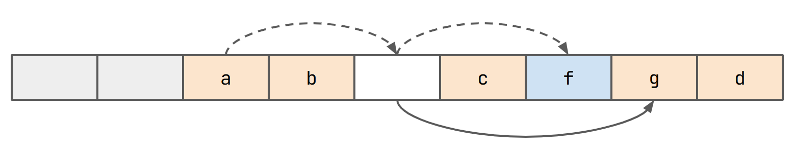
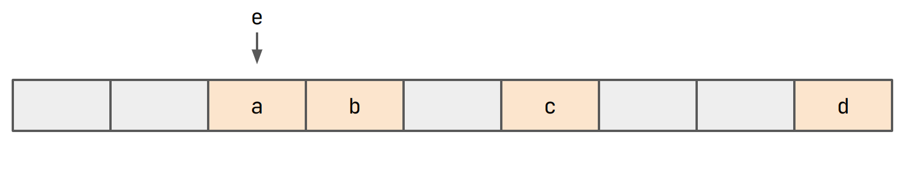
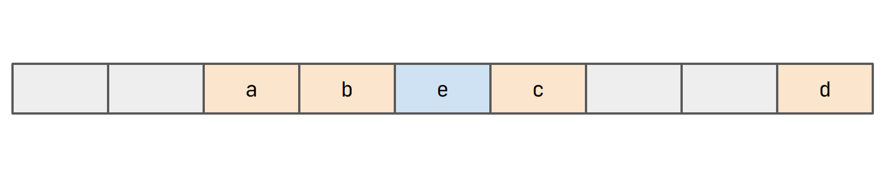
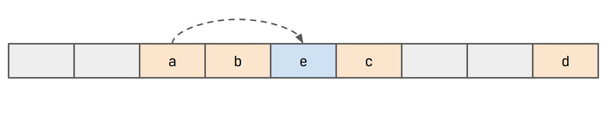
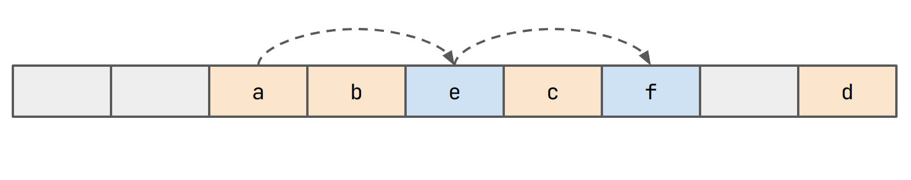
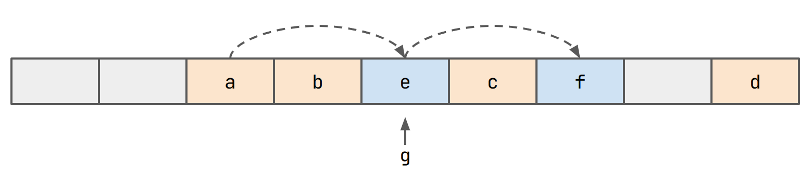
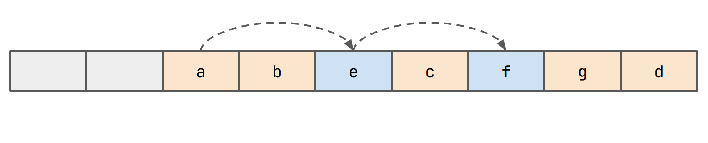
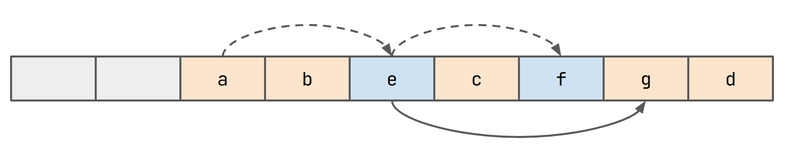
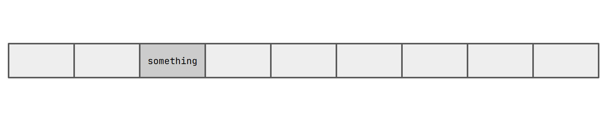

# A New Idea For Reducing Probe-lengths...

Recently, I've upgraded the hashtable project significantly. Firstly, I
am now referring to them as "associative arrays", which sounds far more
fancy and academic. But more importantly, I have created a proper 
framework that we can use to program our hashtables against. It includes
a basic benchmark suite and an extensive suite of tests which can 
generate counter examples. I used all these tools to program a new 
table, which isn't very good (but failed research is still useful).

[Here is a link](https://github.com/D0liphin/AssociativeArrays) to the 
repository. 

## Testing 

The whole framework is built around one vtable struct, called
`astv_array_vtable`. It contains five function pointers, `init()` and
`deinit()` then `insert(k, v)`, `remove(k)` and `lookup(k)`. Sort of
exactly what you would expect. Some other operations that I didn't
bother including are `clear()`, `clone()` and some kind of iterator. It
could be nice to include something that tests iteration speed, but for
now, I'm leaving this for another day. Also, the hashtables all operate
on `(keyint_t, valint_t)` entries. These are currently `intptr_t`s.

Okay, so testing hashtables is pretty easy actually. The first thing I
did was make this exact replica of C++'s `std::unordered_map`...

```c
typedef struct {
        intptr_t _[7];
} cpp_std_unordered_map;
```

Perfect! Just kidding. We just use this as a dummy to write the actual
`std::unordered_map<keyint_t, valint_t>` to. We can also wrap all the 
operations of `std::unordered_map` in C functions so that we can use
them, something like this:

```cpp
void cpp_std_unordered_map_insert(void *tbl, keyint_t k, valint_t v) 
{
    (*(std::unordered_map<keyint_t, valint_t> *)tbl)[k] = v;
}
```

Next up, we can just run random operations on both our implementation
and this at the same time and wait for it to fail. Let's call this
method `test_against_oracle_huge_randoms`. This approach is great,
because it gives us pretty high confidence that our table works. The
issue with it is that when it fails, tracing exactly why it failed is
really _really_ hard. As a result, I did a couple extra things.

First, generate every single possible ordering of `remove()`/`insert()`.
We do this for up to `k = 8` and for sequences up to length `7`. Values
only need to be binary (`1` or `0`). Using more values is basically 
pointless because for any case where the value happens to be the same,
there is another combination where it isn't. After executing each 
sequence on the oracle and the test table, we check that looking up 
all keys up to `k = 8` produces identical results.

This lets us generate _readable_ counter examples as code. Here's an 
example output from the test suite.

```c
// Failed to match oracle output on below test case
int main()
{
        jtable tbl;
        struct astv_array_vtable vtbl = jtable_vtable();
        vtbl.init(&tbl);
        vtbl.insert(&tbl, 6, 0);
        vtbl.insert(&tbl, 0, 1);
        valint_t *v = vtbl.lookup(&tbl, 0);
        assert(v != NULL);
        assert(*v == 1);
        vtbl.deinit(&tbl);
        return 0;
}
```

Indeed, I found **seven** _different_ bugs this way! However, my code
was still not working on `test_against_oracle_huge_randoms`. A new 
test case was needed! This time, I generate about 100-million random 
counter examples for different sequence lengths and with much larger
possible keys (up to `32`). This approach generated another seven 
counter examples. The last one only came up after 300-million tests!

Finally, I was confident that my table was working. At the same time 
though, I am now totally convinced that I have almost never written
correct software before this. 

## Benchmarking

Benchmarking is done with Google's benchmark library and then I plot 
things with `plotly`. Exactly what kind of benchmarks one should use for
this sort of thing is a little tricky. In the end, I decided on four 
options that are supposed to give you some kind of 'holistic' idea 
of usage

- `insert_2update_randoms` 
  - insert `N` randoms in range `[0, N)`.
  - update each key twice
- `insert_remove_all_randoms` 
  - insert `N` randoms in range `[0, N)`
  - remove all entries in reverse order
- `insert_remove_lookup`
  - insert `N` randoms in range `[0, N)`
  - remove `N / 2` randoms in range `[0, N)`
  - lookup `N / 2` randoms in range `[0, N)`
- `insert_remove_alt`
  - insert `N / 2` randoms in range `[0, N)`
  - remove `N / 2` randoms in range `[0, N)`
  - repeat 8 times

## `jtable`

`jtable` is a table that aims to benefit from some level of 
cache-locality that is provided by linear-probing lookup, but with
the consistency of a chaining approach. It's a failed idea, at least 
in its current form. Failed research is stil research though, especially
if you learn _why_ it failed. The next article should be about trying 
to make this approach work better, this one just describes it.

`jtable` uses a flat buffer to store everything. Let's start by 
inserting `a`, `b`, `c` and `d`. We ignore values here.



Let's say that `hash(e) == hash(a)`. In this case, we want to place `e`
in the same bucket.



Since we can't do this, we probe for an empty slot and insert `e`. 



We maintain a pointer from the bucket containing `a` to the bucket 
containing `e`. This represents a chain.



Intuitively, `e` will be close to `a`. The pointers should let us 
skip any unnecessary comparisons though.

Further items might be added to the chain. For example consider the case
where `hash(f) == hash(e) == hash(a)`:



Okay, but we have a problem now. What if `hash(g) == idxof(e)`?



Again, we probe and insert `g` in the slot we find.



We need to maintain another pointer from the bucket that `e` is in to 
`g` now.



This way, if we need to lookup `g`, we first check if the bucket is 
occupied with a non-head value (here marked in blue) and if it is, find 
the true head in one jump. Notice also that we can do any kind of 
probing we want here. One great idea would be to do double-hashing. 

Remember back when I did [that article about hashtable math](https://www.oliveriliffe.net/blog/hashtbl-math/hashtbl-math.html)? 
I'm sure as an avid reader you do remember `;)`. Anyway, here I made 
the assumption that given that slot `i` is not occupied, the chance that
slot `i + 1` is not occupied is still just the load of the table.

> Recall, the 'load' (lowercase `l`) of the table is the percentage of 
> the table that is occupied. The 'load-factor' (uppercase `L`) is the 
> percentage of the table that needs to be occupied for us to reallocate
> and rehash everything.

However, this is just not true! Let's say I have 8 slots in my buffer.
They all start off empty, so whichever one I fill (considering a totally
random hash function) is random. So let's go ahead and fill in slot `2`.



A subsequent insert will select an index in the range `[0, 8)` at 
random. However, slot `2` is occupied now. And if we choose slot `2`,
we deterministically end up filling slot `3`. So slot `3` is _twice_ 
as likely to be filled. This actually _snowballs_ really fast!